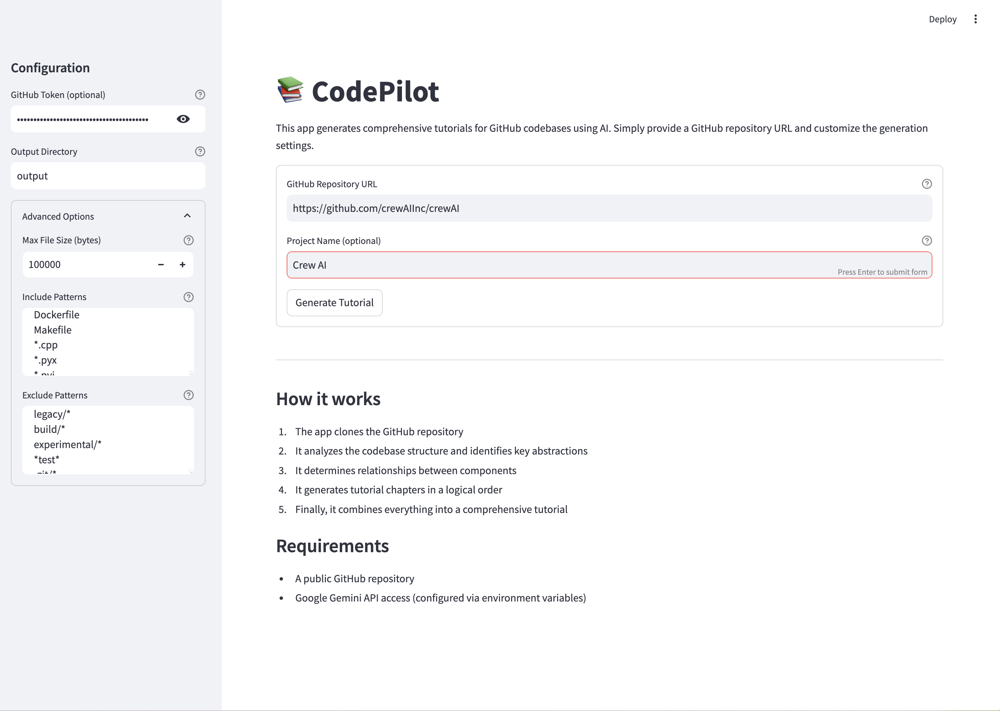
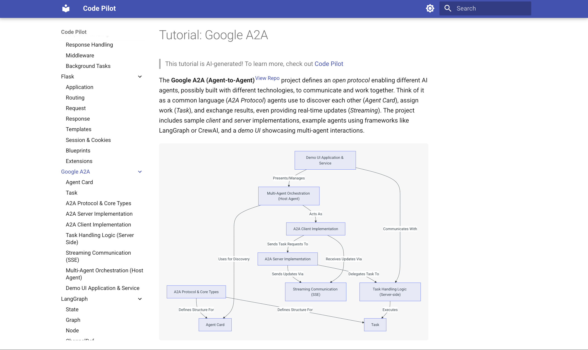

<h1 align="center">CodePilot</h1>

<div align="center">
  
  ### [🔗 Live Demo](https://setiadeepanshu01.github.io/Code-Pilot/)
  
</div>


> *Ever stared at a new codebase written by others feeling completely lost? This tutorial shows you how to build an AI agent that analyzes GitHub repositories and creates beginner-friendly tutorials explaining exactly how the code works.*

<div align="center">
  <h3>📊 Streamlit App</h3>
  
</div>

This project crawls GitHub repositories and builds a knowledge base from the code. It analyzes entire codebases to identify core abstractions and how they interact, and transforms complex code into beginner-friendly tutorials with clear visualizations.

<p align="center">
    
</p>

## ⭐ Example Results for Popular GitHub Repositories!


<div align="center">
  <h3>🔍 Sample Tutorial Output</h3>
  
</div>


🤯 All these tutorials are generated **entirely by AI** by crawling the GitHub repo!

- [AutoGen Core](https://setiadeepanshu01.github.io/Code-Pilot/AutoGen%20Core) - Build AI teams that talk, think, and solve problems together like coworkers!

- [Browser Use](https://setiadeepanshu01.github.io/Code-Pilot/Browser%20Use) - Let AI surf the web for you, clicking buttons and filling forms like a digital assistant!

- [Celery](https://setiadeepanshu01.github.io/Code-Pilot/Celery) - Supercharge your app with background tasks that run while you sleep!

- [Click](https://setiadeepanshu01.github.io/Code-Pilot/Click) - Turn Python functions into slick command-line tools with just a decorator!

- [Codex](https://setiadeepanshu01.github.io/Code-Pilot/Codex) - Turn plain English into working code with this AI terminal wizard!

- [Crawl4AI](https://setiadeepanshu01.github.io/Code-Pilot/Crawl4AI) - Train your AI to extract exactly what matters from any website!

- [CrewAI](https://setiadeepanshu01.github.io/Code-Pilot/CrewAI) - Assemble a dream team of AI specialists to tackle impossible problems!

- [DSPy](https://setiadeepanshu01.github.io/Code-Pilot/DSPy) - Build LLM apps like Lego blocks that optimize themselves!

- [FastAPI](https://setiadeepanshu01.github.io/Code-Pilot/FastAPI) - Create APIs at lightning speed with automatic docs that clients will love!

- [Flask](https://setiadeepanshu01.github.io/Code-Pilot/Flask) - Craft web apps with minimal code that scales from prototype to production!

- [Google A2A](https://setiadeepanshu01.github.io/Code-Pilot/Google%20A2A) - The universal language that lets AI agents collaborate across borders!

- [LangGraph](https://setiadeepanshu01.github.io/Code-Pilot/LangGraph) - Design AI agents as flowcharts where each step remembers what happened before!

- [LevelDB](https://setiadeepanshu01.github.io/Code-Pilot/LevelDB) - Store data at warp speed with Google's engine that powers blockchains!

- [MCP Python SDK](https://setiadeepanshu01.github.io/Code-Pilot/MCP%20Python%20SDK) - Build powerful apps that communicate through an elegant protocol without sweating the details!

- [NumPy Core](https://setiadeepanshu01.github.io/Code-Pilot/NumPy%20Core) - Master the engine behind data science that makes Python as fast as C!

- [OpenManus](https://setiadeepanshu01.github.io/Code-Pilot/OpenManus) - Build AI agents with digital brains that think, learn, and use tools just like humans do!

- [Pydantic Core](https://setiadeepanshu01.github.io/Code-Pilot/Pydantic%20Core) - Validate data at rocket speed with just Python type hints!

- [Requests](https://setiadeepanshu01.github.io/Code-Pilot/Requests) - Talk to the internet in Python with code so simple it feels like cheating!

- [SmolaAgents](./docs/SmolaAgents) - Build tiny AI agents that punch way above their weight class!

## 🚀 Getting Started

1. Clone this repository

2. Install dependencies:
   ```bash
   pip install -r requirements.txt
   ```

3. Set up LLM in [`utils/call_llm.py`](./utils/call_llm.py) by providing credentials. By default, you can use the AI Studio key with this client for Gemini Pro 2.5:

   ```python
   client = genai.Client(
     api_key=os.getenv("GEMINI_API_KEY", "your-api_key"),
   )
   ```

   You can use your own models. We highly recommend the latest models with thinking capabilities (Claude 3.7 with thinking, O1). You can verify that it is correctly set up by running:
   ```bash
   python utils/call_llm.py
   ```

4. Generate a complete codebase tutorial by running the main script:
    ```bash
    # Analyze a GitHub repository
    python main.py --repo https://github.com/username/repo --include "*.py" "*.js" --exclude "tests/*" --max-size 50000

    # Or, analyze a local directory
    python main.py --dir /path/to/your/codebase --include "*.py" --exclude "*test*"

    # Or, generate a tutorial in Chinese
    python main.py --repo https://github.com/username/repo --language "Chinese"
    ```

    - `--repo` or `--dir` - Specify either a GitHub repo URL or a local directory path (required, mutually exclusive)
    - `-n, --name` - Project name (optional, derived from URL/directory if omitted)
    - `-t, --token` - GitHub token (or set GITHUB_TOKEN environment variable)
    - `-o, --output` - Output directory (default: ./output)
    - `-i, --include` - Files to include (e.g., "*.py" "*.js")
    - `-e, --exclude` - Files to exclude (e.g., "tests/*" "docs/*")
    - `-s, --max-size` - Maximum file size in bytes (default: 100KB)
    - `--language` - Language for the generated tutorial (default: "english")

The application will crawl the repository, analyze the codebase structure, generate tutorial content in the specified language, and save the output in the specified directory (default: ./output).
